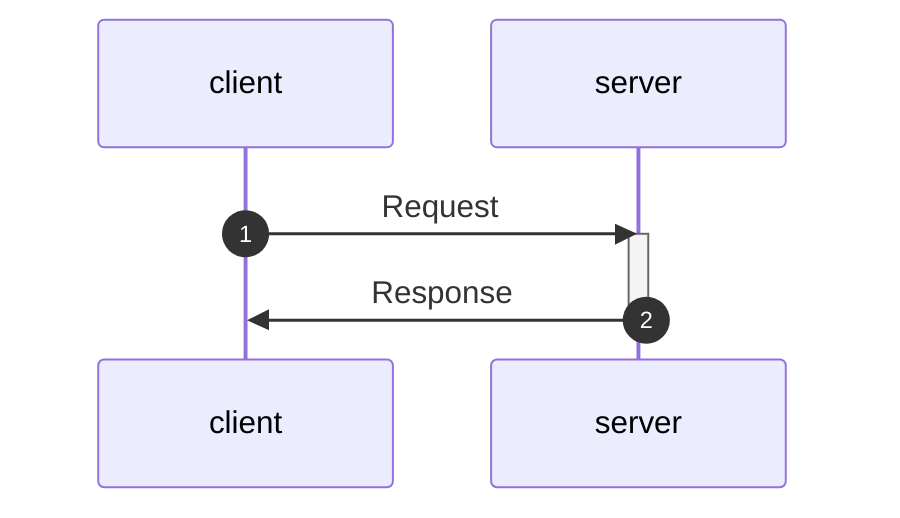

# gRPC Series with Node.js

## What is gRPC?

According to the [grpc.io](https://grpc.io/)
**_gRPC is a modern open source high performance Remote Procedure Call (RPC) framework that can run in any environment. It can efficiently connect services in and across data centers with pluggable support for load balancing, tracing, health checking and authentication. It is also applicable in last mile of distributed computing to connect devices, mobile applications and browsers to backend services._**

## Protocol

```protobuf
// protocol/square.proto
syntax = "proto3";

package square.v1;

message squareRequest {
    double number = 1;
}

message squareResponse {
    double number=1;
}


// Services for the system
service SquareService {
    rpc square(squareRequest) returns (squareResponse) {}
}
```

## Server (server.js)

```javascript
// importing grpc related stuff
const grpc = require("grpc");
const path = require("path");
const protoLoader = require("@grpc/proto-loader");

// package definition
const packageDefinition = protoLoader.loadSync(
  path.resolve(__dirname, "protocol/square.proto"),
  {
    keepCase: true,
    longs: String,
    enums: String,
    default: true,
    oneofs: true,
  }
);

const protoDescriptor = grpc.loadPackageDefinition(packageDefinition);

// Get the package name
const squarePackage = protoDescriptor.square.v1;

// calculate the square of the number
const square = (call, callback) => {
  const number = call.request.number;
  const square_number = Math.pow(number, 2);
  response = { number: square_number };
  error = null;
  callback(error, response);
};

// Creating the Server
const server = new grpc.Server();
// Adding services to the server
server.addService(squarePackage.SquareService.service, {
  square: square,
});

// Binding the server
const HOST = "localhost";
const PORT = 90052;
server.bind(`${HOST}:${PORT}`, grpc.ServerCredentials.createInsecure());

// starting the grpc server
server.start();
console.log(`Server started on ${HOST}:${PORT}`);
```

## Client (client.js)

```javascript
// importing grpc related stuff
const grpc = require("grpc");
const path = require("path");
const protoLoader = require("@grpc/proto-loader");

// package definition
const packageDefinition = protoLoader.loadSync(
  path.resolve(__dirname, "protocol/square.proto"),
  {
    keepCase: true,
    longs: String,
    enums: String,
    default: true,
    oneofs: true,
  }
);

const protoDescriptor = grpc.loadPackageDefinition(packageDefinition);

// Get the package name
const squarePackage = protoDescriptor.square.v1;

// connect the client to the server
const HOST = "localhost";
const PORT = 90052;
const client = new squarePackage.SquareService(
  `${HOST}:${PORT}`,
  grpc.credentials.createInsecure()
);

// make the request for server to calculate the square of the number
const request = { number: 10.2 };

// make request, and get the response
client.square(request, (err, response) => {
  console.log(response);
});
```

## Setting up the project

```console
npm init -y
```

### installing dependencies

```console
npm install grpc @grpc/proto-loader
```

### Starting the server

```console
node server.js
```

### Starting the client to make request

```console
node client.js
```

## Flow chart



## TodoList

- [✓] uniary methods
- [] grpc explanation
- [] streaming methods
- [] proto explanation
- [] step by step code explanation
